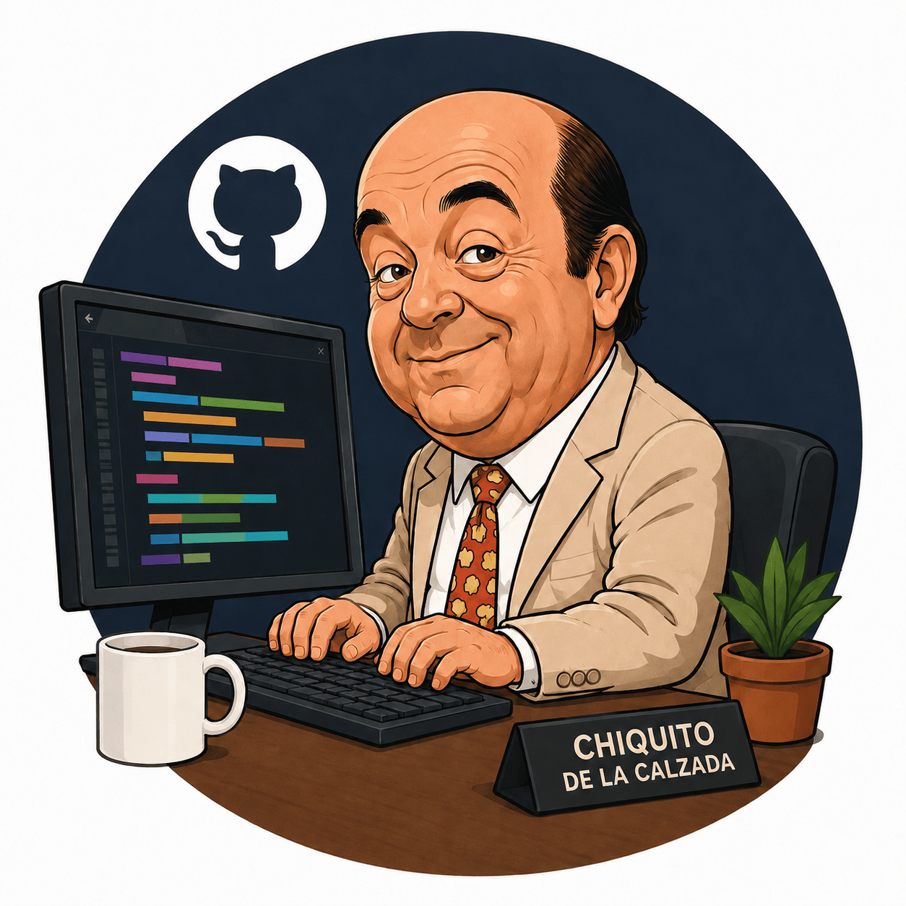

<p align="center">
  
</p>

# FISTRO PUBLIC LICENSE

> **¡Al ataquerrr, pecaorrr!** Licencia de software pública, libre, gratuita, completamente delirante y jurídicamente vinculante. Pa que liberes tu codigorrr al mundo con más muletillas que un partido del Fary en plenas Navidades. ¿Te da cuen?

[](https://github.com/devnix/fistro-public-license)

> ⚠️ **El identificador `FPL-1.0` aún NO ha sido sometido a SPDX** (submission pendiente). Mientras tanto, en cabeceras y `package.json`/`plugin.json` usa `LicenseRef-FPL-1.0`. El badge pasará a decir `FPL-1.0` el día que SPDX lo bendigarrl.

---

## ¿Qué es estor, fistro?

La **FISTRO PUBLIC LICENSE (FPL) v1.0 ("Diodená")** es una licencia open source derivada legal de la **WTFPL v2** de Sam Hocevar, al amparo de su propia cláusula de renombrado.

**Es humorística en la formarrr y vinculante en el fondorrr**: cesión universal de derechos + disclaimer de garantía explícito + cláusula de fuerza mayorrrl con fallback a WTFPL v2. Más legar que la suegra del notario, hijo míoorrr.

## Cómo aplicarla a tu proyecto, pecaorrr

Cuatro pasos más fáciles que el mecanismo de un botijorrr:

1. **Copia** [`LICENSE.txt`](./LICENSE.txt) a la raíz de tu repo.
2. **Reemplaza los placeholders SOLO de la línea 4** (la línea 2 NO se toca, fistro — `año 2026` es el año de la versión de la licencia, NO el de tu copyright):
   - `<AÑO>` → el año en que aplicas la licencia (p.ej. `2026`).
   - `<TITULARRRRR DEL COPYRIGHT>` → tu nombre o el de tu organización (p.ej. `Manolita Fistraza`).
3. **(Opcional)** añade en las cabeceras de tus archivos fuente:
   ```
   // SPDX-License-Identifier: LicenseRef-FPL-1.0
   ```
   Cuando la FPL esté en SPDX oficiarrl pasarás a usar `FPL-1.0` sin el `LicenseRef-`.
4. **(Opcional)** mete un badge en tu README pa que se vea el peaso de licencia que llevas:
   ```markdown
   [](https://github.com/devnix/fistro-public-license)
   ```

¡Y ya estás más libre que el Fary en un karaokerl!

## ¿Por qué no usar la WTFPL directamente, hijo míoorrr?

La WTFPL v2 es elegante pero le faltan tres cosillas que la FPL incorpora pa cubrirte el fistro:

- **Cláusula 1 vinculante de garantía**. La WTFPL canónica no tiene disclaimer expreso de garantía. La FPL sí — y eso es lo que te separa de que un día te demanderrr un señorito porque "el codigorrr le rompió el ordenadorrl".
- **Severabilidarrl explícita** (CASO DE FUERZA MAYORRRRL, cláusula i). Si una jurisdicción rechaza alguna parte, el resto sigue en pie como un dolmen.
- **Fallback a WTFPL v2** (cláusula ii). Si la FPL no es válida en algún sitio raro, "aplicas mentalmente la WTFPL v2 originarl" y te quedas tan a güán.

Y, pol encima de tó, **es más divertida que un capítulo de los Fruitis después de un cafelito**.

## ¿Y la atribución, fistro? ¿Tengo que poner tu nombre?

**No.** Atribución 100% opcionarl (anexo d). Si tienes tiempo y ganas, una mención al ilustre Gregorio Sánchez Fernández la agradecerá tu karma cultural — pero ni a él ni a nadie le debes nada legalmente. ¡Hasta luego Lucas!

## Estado del reconocimiento oficial

| Sistema | Estado | Notas |
|---|---|---|
| **SPDX** | ⚪ Submission pendiente | Identificador propuesto (todavía no sometido): `FPL-1.0`. |
| **GitHub** (vía `licensee`) | ⚪ Detectado como "Other" | Se desbloquea automáticamente cuando SPDX la incorpore. |
| **FSF** (Free Software Foundation) | ⚪ No solicitado | Podría hacerse tras SPDX. |
| **OSI** (Open Source Initiative) | ⚪ No solicitado | OSI rechazó la WTFPL en 2009; misma situación esperada. |

## Estructura de este repositorio

```
fistro-public-license/
├── LICENSE.txt                       # texto canónico de la FPL v1.0 (con placeholders) — copia byte-idéntica de versions/1.0/LICENSE.txt
├── versions/
│   └── 1.0/
│       └── LICENSE.txt               # texto inmutable de la v1.0 ("Diodená")
└── README.md                         # estor que estás leyendo, fistro
```

Más adelante la estructura crecerá con `spdx/FPL-1.0.xml`, `badges/`, GitHub Pages, etc.

## Proyectos que la usan, ¡aguaaa aguaaa!

- [**chiskillto**](https://github.com/devnix/chiskillto) — plugin de Claude Code para hablar como Chiquito de la Calzada. El primer adopter y la razón por la que esta licencia existe, pecaorrr.
- ¿Tu proyecto? Manda un PR a este repo añadiéndolo aquí, fistro. Cuantos más adopters, más legitimidad ante el SPDX legal team.

## FAQ del ilustre

**¿Es legalmente válida?**
Sí, con caveats. Hereda la (limitada) validez de la WTFPL v2 y la mejora con cláusula 1 vinculante y fuerza mayor. Cuatro subagentes independientes validaron la licencia (legal, cumplimiento WTFPL, consistencia interna, tooling). Recomendada pa proyectos personales, hobby, herramientas, scripts y todo lo que no implique a una empresa Fortune 500 con un Chief Compliance Officer paranoico.

**¿Puedo modificar el texto?**
Sí, fistro, pero **tienes que cambiarle el nombre**. Es la propia cláusula que la FPL hereda de la WTFPL. Si tu versión se llama "PECAORRRR PUBLIC LICENSE" o "JARRRL PUBLIC LICENSE", a güán. Si la sigues llamando "FISTRO PUBLIC LICENSE", te estás cargando la cláusula y queda inválida.

**¿Qué pasa con los derechos morales en España y la UE?**
La sección "CASO DE FUERZA MAYORRRRL" del LICENSE los reserva explícitamente. La cesión de derechos patrimoniales es total; los morales (paternidad, integridad de la obra) se mantienen intactos. Eso no se renunciar en derecho civil europeo, ni con esta licencia ni con ninguna.

**¿Se puede usar comercialmente?**
Sí, pecaorrr. Anexo a) lo dice claramente: "pa proyectos personales, comercialesrrl, malosrrr, buenosrrr…". Cero restricciones.

**¿Y si soy una empresa con compliance estricto?**
Hasta que la FPL esté en SPDX, tu departamento legal va a poner mala cara. Mientras, considera **dual-licensing** (FPL + MIT, FPL + Apache-2.0): ofreces ambas y cada uno elige. La gente cool elige la FPL.

**¿Por qué Chiquito de la Calzada?**
Por la gloria de mi madrerrr, fistro. ¿Te da cuen? Pero también porque las licencias humorísticas (Beerware, JSON "shall be used for Good, not Evil") son reconocidas oficialmente por SPDX. El humor no anula la validez legal — al contrario, **expresa la intención de las partes con un tono que un juez interpretará como clara cesión voluntaria de derechos**.

## Créditos

- **Sam Hocevar** (https://github.com/samhocevar) — autor de la WTFPL v2, base legal y modelo de elegancia jurídica permisiva.
- **Gregorio "Chiquito de la Calzada" Sánchez Fernández** (Málaga, 1932–2017) — inspiración cultural y verbal. El míster. El ilustre. Sin él, ná. [Wikipedia](https://es.wikipedia.org/wiki/Chiquito_de_la_Calzada).
- **Ilustración de cabecera** (`assets/chiquito-coding.png`): caricatura del ilustre Gregorio Sánchez Fernández creada para este repo. Se distribuye bajo los mismos términos que el resto del repositorio (FPL v1.0).

## Licencia de este repositorio

El texto de la FPL v1.0 contenido en este repositorio se distribuye bajo los términos de **la propia FPL v1.0** — la cláusula de "copy and distribute verbatim or modified copies" que hereda de la WTFPL aplica recursivamente. Es decir: puedes copiar, redistribuir y modificar este texto, **siempre que si lo modificas le cambies el nombre**.

Los recursos visuales en `assets/` se distribuyen igualmente bajo la FPL v1.0 salvo nota expresa en contrario.

Recursividarl, fistro. Como los espejos de barbería.

---

¡**Hasta luego Lucasss!** Y recuerda, pecaorrr: liberar codigorrr es un acto de generosidarrl. Hacerlo con la FPL es un acto de generosidarrl con estilo. **¡Por la gloria de mi madrerrr!**
